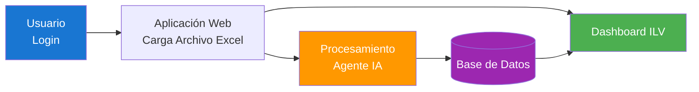
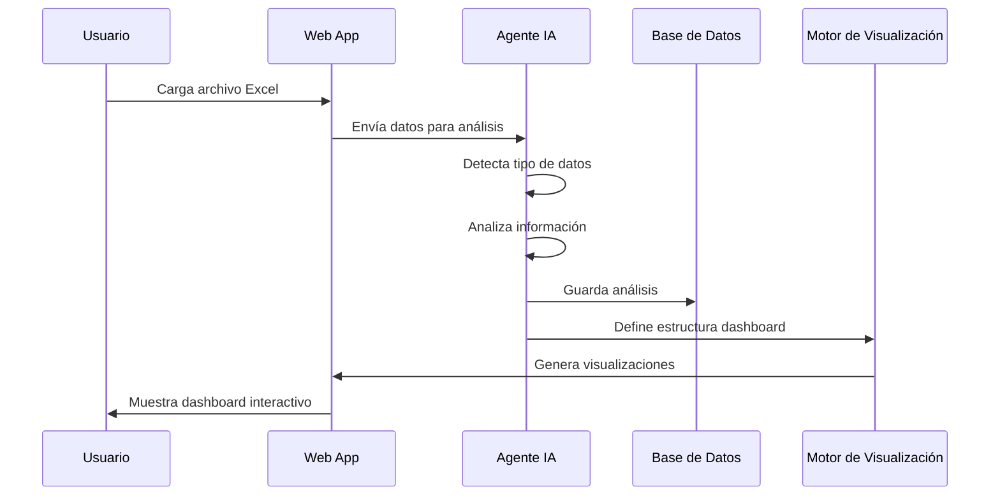
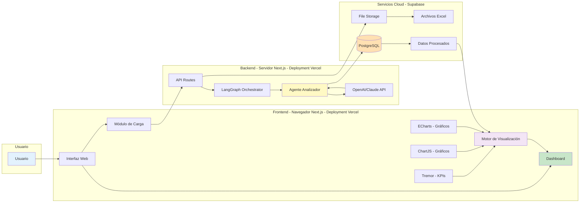
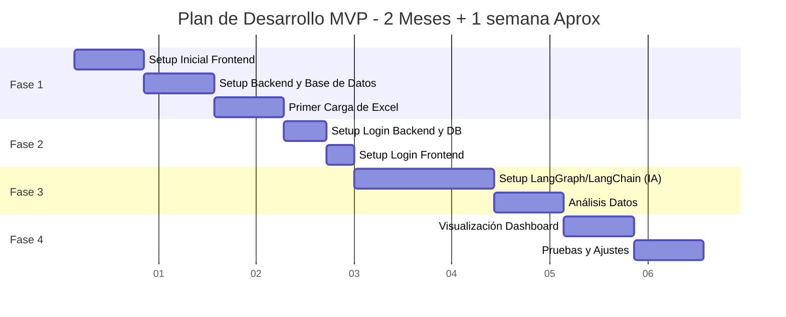

# Proyecto Reporting ILV - Dashboard Ejecutivo

## Objetivo del MVP

Desarrollar una plataforma web que permita cargar archivos Excel con información financiera, analizarlos automáticamente mediante agentes de IA, y generar dashboards ejecutivos personalizados según el tipo de datos detectados. Todo esto desplegado en la web, accesible desde cualquier navegador, sin necesidad de instalaciones locales.

## 🤖 Alcance del MVP

1. **Autenticación (Login/Logout)** básico que permite el ingreso seguro a la información de ILV desde cualquier navegador
2. **Cargar archivos Excel** directamente en la plataforma o conectar con Google Drive (por definir)
3. **Análisis automático** mediante agentes IA que comprenden el contexto financiero y generan la información necesaria para su visualización
4. **Generación inteligente de dashboards** adaptados al tipo de información y con base en los requerimientos de ILV

### Arquitectura Simplificada del Sistema

### Flujo de Trabajo del Sistema

### Arquitectura Detallada del Sistema

## 🛠️ Stack Tecnológico

### **Base del Sistema**

- **Next.js con TypeScript**: Framework full-stack que nos permite tener frontend y backend en un solo proyecto
- **Supabase**: Base de datos PostgreSQL en la nube con almacenamiento de archivos integrado (y acceso futuro a bases de datos vectorizadas para RAG)
- **Vercel**: Hosting con despliegue automático y escalabilidad global

### **Inteligencia Artificial**

- **LangGraph/LangChain**: Orquestación de agentes IA para análisis financiero
- **OpenAI GPT / Anthropic Claude**: Modelos de lenguaje para comprensión y análisis de datos
- **Model Context Protocol (MCP)**: Estándar abierto para integración con herramientas IA

### **Visualización de Datos (por definir uno o varios)**

- **ChartJS**: Librería open source para visualización de gráficos
- **Tremor**: Componentes ejecutivos pre-diseñados (KPIs, métricas, comparaciones)
- **Apache ECharts**: Gráficos avanzados (waterfall, treemaps, heatmaps)

## 🚀 Plan de Implementación (dedicación aprox: 4hr/día)

### Fase 1: Infraestructura Base (3 semanas)

- Configuración del proyecto Next.js con TypeScript
- Integración con Supabase (base de datos y storage)
- Carga de archivos Excel

### Fase 2: Login (1 semana)

- Implementación backend y base de datos para el sistema de login básico (ingreso con email y password)
- Creación de página de login en frontend con ingreso de email y password

### Fase 3: Inteligencia Artificial (3 semanas)

- Implementación de agentes con LangGraph/LangChain
- Análisis automático de estructura de datos
- Generación de insights automáticos como input para frontend

### Fase 4: Visualización y Dashboard (2 semanas)

- Conexión frontend con resultados de IA
- Generación de gráficos de acuerdo a reportes de IA
- Pruebas y ajustes finales

### Timeline del MVP

## 💰 Inversión

### MVP (2 meses)

- **Horas estimadas (tiempo aproximado)**: 10.800USD equivalentes a 180 horas (4 horas/día × 45 días)

### Costos de Infraestructura (estimación mensual)

- **Supabase**: Plan Pro ~$0-25USD/mes
- **Vercel**: Plan Pro ~$0-20USD/mes
- **OpenAI/Claude API**: ~$0-100USD/mes según uso
- **Total estimado**: ~$0-150USD/mes según uso

## 🔮 Expansiones Futuras (sugeridas, por definir)

### Fase 2: Avance de Plan de Trabajo

- Earn Value Management (PMI-EVM)
- Gráficas adicionales para Project Management

### Fase 3: Presupuesto Operativo

- Earn Value Management (PMI-EVM)
- Gráficas adicionales para Presupuesto Operativo

### Fase 4: Multi-Empresa

- Sistema que replique análisis para las demás empresas del Grupo Malatesta

---

Este MVP sentará las bases para un sistema robusto que puede evolucionar según las necesidades del equipo. La arquitectura modular permite agregar nuevos tipos de análisis, agentes y fuentes de datos.
