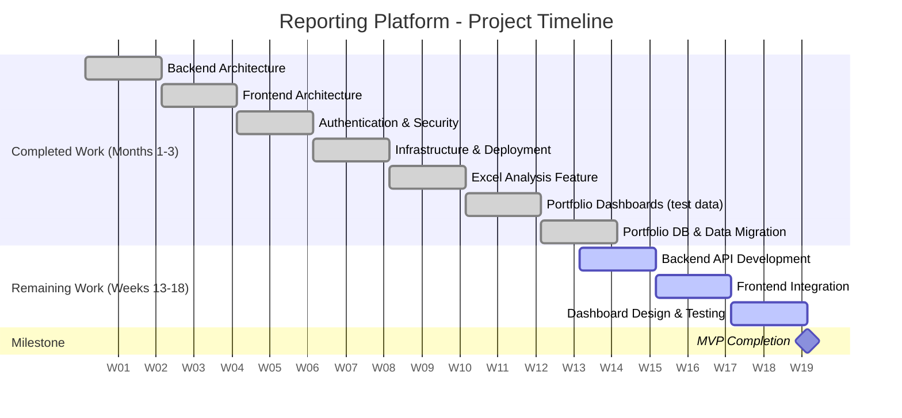

# Chapter 5: Roadmap to MVP Completion

## 5.1 MVP Definition

MVP means the platform is operational for portfolio reporting: you can log in, view all holdings across all asset classes with current valuations and performance, filter and analyze data through various views, and trust the information is accurate and current.

Not "barely functional", fully operational for core reporting needs, with advanced features planned for later releases.

## 5.2 Remaining Work (120 Hours / 6 Weeks)

_Assumes 4 hours per day of dedicated development time_

### 5.2.1 Weeks 1-2: Backend API Development (50 hours)

Build server endpoints that allow dashboards to request your portfolio data from the database.

**What's required:**

- General asset query endpoint with filtering (holding entity, asset group, status, etc.)
- Specialized endpoints for equities, commodities, alternatives, and structured notes
- Data joining from Assets table with extension tables (Structured Notes, Real Estate)
- Authentication and authorization on all endpoints
- Input validation, error handling, and query optimization
- Pagination support for large result sets

### 5.2.2 Weeks 3-4: Frontend Integration (50 hours)

Connect dashboards to backend APIs to display your portfolio data that's already in the database.

**What's required:**

- Replace mock data fetching with API calls to new portfolio endpoints
- Implement Redux Toolkit for state management (caching, data synchronization, async actions)
- Handle loading states and error conditions (network failures, session expiration, invalid responses)
- Test all visualizations with your real portfolio data
- Adjust for edge cases or data patterns that demonstration data didn't reveal
- Ensure all dashboards correctly display holdings, valuations, and performance metrics

### 5.2.3 Weeks 5-6: Final Dashboard Design & Testing (20 hours)

Refine dashboard layouts, charts, and tables based on real data. Verify system performance and complete operational setup.

**What's required:**

- **Dashboard design refinement:** Adjust chart types, table layouts, and metric displays based on actual portfolio data patterns
- **Content optimization:** Ensure charts and tables effectively present your specific holdings (structured notes terms, equity sectors, commodity positions, alternative investments)
- Full system testing with complete portfolio at realistic usage patterns
- Database query optimization if any queries prove slow
- Backend configuration (connection pools, logging, monitoring)
- Security configuration review
- Performance verification

## 5.3 Timeline Summary

**Weeks 1-2:** Backend API development. APIs functional and tested with your real data by end of week 2.

**Weeks 3-4:** Frontend integration connecting dashboards to APIs. Real portfolio holdings visible in reporting interface by end of week 4.

**Weeks 5-6:** Dashboard design refinement based on real data. Final testing, performance optimization, operational setup.

## 5.4 Project Timeline Overview

The following Gantt chart shows the complete project timeline, including work already completed over the past 3 months and the remaining 6-week path to MVP completion:

## 5.5 Post-MVP Enhancements

The platform's architecture enables powerful additions based on priorities and feedback:

**Conversational Data Access:** Supabase MCP integration for natural language queries—ask "Show me all structured notes maturing in Q1" and get instant answers without navigating dashboards.

**Enhanced Analytics:** Additional detailed tables, specialized charts, and custom views based on actual usage patterns.

**Operational Integration:** Extend beyond portfolio reporting to operational workflows, project management, or other business processes.

**Automated Data Feeds:** External data source connections for automatic position updates, market prices, and valuations.

**Intelligent Data Extraction:** Automate processing of monthly Excel files from different sources. Rather than manually consolidating data from multiple spreadsheets with varying formats, the system automatically parses, validates, and imports information.

**Advanced Reporting:** PDF exports, scheduled reports, custom templates for different stakeholders.

These enhancements build on the MVP foundation without requiring architectural changes.
